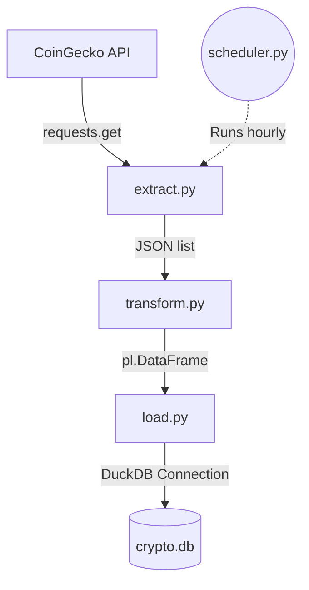

# Crypto Market Dashboard Pipeline
> *An automated ETL pipeline extracting live crypto data, transforming it with Polars, and storing it in DuckDB.*

---

## ⚙️ Project Type Flags

- [x] Data Pipeline / ETL
- [ ] Exploratory Data Analysis (EDA)
- [ ] SQL Analysis / Querying
- [ ] Dashboard / Data Visualization
- [ ] Predictive Modelling / Machine Learning
- [ ] Data Cleaning / Wrangling
- [ ] End-to-End (multiple of the above)

---

## Table of Contents
- [\[Project Title\]](#project-title)
  - [⚙️ Project Type Flags](#️-project-type-flags)
  - [Table of Contents](#table-of-contents)
  - [1. Project Overview](#1-project-overview)
  - [2. Objectives](#2-objectives)
  - [3. Project Scope \& Tools](#3-project-scope--tools)
    - [Scope](#scope)
    - [Tools \& Technologies](#tools--technologies)
  - [4. Repository Structure](#4-repository-structure)
  - [5. Data Workflow](#5-data-workflow)
  - [6. Data Model \& Schema](#6-data-model--schema)
    - [Dataset / Table: `coins`](#dataset--table-coins)
  - [8. Analysis \& Metrics](#8-analysis--metrics)
    - [Analytical Approach](#analytical-approach)
    - [Key Metrics Defined](#key-metrics-defined)
    - [Methods Used](#methods-used)
  - [9. Key Insights](#9-key-insights)
  - [10. Recommendations](#10-recommendations)
  - [11. Assumptions \& Limitations](#11-assumptions--limitations)
    - [Assumptions](#assumptions)
    - [Limitations](#limitations)
  - [12. Future Enhancements](#12-future-enhancements)
  - [13. Deliverables](#13-deliverables)
  - [14. Author](#14-author)

---

## 1. Project Overview

**Context:** A cryptocurrency market dashboard requires fresh, queryable data on top coins to provide accurate market snapshots to users.

**Problem Statement:** Fetching, cleaning, and storing this data manually is inefficient and doesn't scale for an always-on dashboard. There needed to be an automated process to handle this workflow seamlessly.

**Approach:** Developed an automated ETL pipeline using Python. It extracts top 10 coin data from the CoinGecko API, transforms it via Polars (filtering zero market caps and calculating price ranges), and loads it into a DuckDB instance, scheduled to run every hour.

**Outcome:** A robust, scheduled data pipeline that reliably updates a local `crypto.db` database with the latest top cryptocurrency market metrics, ready for downstream analysis.

---

## 2. Objectives

- **Primary Objective:** Build a reproducible, scheduled ETL pipeline that ingests live cryptocurrency market data.
- **Secondary Objective 1:** Efficiently clean and transform the JSON payload using the high-performance Polars library.
- **Secondary Objective 2:** Store the processed data in a lightweight DuckDB database to serve as an analytical backend.

> 💡 *Every analysis decision in this project traces back to one of these objectives.*

---

## 3. Project Scope & Tools

### Scope

| Dimension | Details |
|-----------|---------|
| **In Scope** | Extracting current market data for the top 10 cryptocurrencies (by USD market cap) from CoinGecko, transforming the dataset, and storing it locally. |
| **Out of Scope** | Dashboard UI creation and historical time-series storage (the database table is overwritten hourly). |
| **Time Period** | Live snapshot (updated hourly). |
| **Granularity** | Coin-level aggregations (one row per cryptocurrency). |

### Tools & Technologies

| Category | Tool(s) Used |
|----------|-------------|
| Data Storage | DuckDB (`crypto.db`) |
| Data Processing | Python, Polars |
| Ingestion | `requests`, CoinGecko API |
| Orchestration | `schedule` (Python library) |
| Version Control | Git / GitHub |
| Documentation | Markdown |

---

## 4. Repository Structure

```text
[project-root]/
│
├── scripts/                  # Reusable ETL processing files
│   ├── extract.py            # API ingestion
│   ├── transform.py          # Polars data cleaning
│   ├── load.py               # DuckDB loading
│   ├── main.py               # Pipeline orchestration
│   ├── scheduler.py          # Hourly cron-like job
│   ├── log.py                # Logging configuration
│   └── verify.py             # DuckDB table verification
│
├── reports/                  # Final outputs
│   └── REPORT.md             # Full structured report
│
├── pyproject.toml            # uv-managed dependencies
├── README.md                 # Project one-pager
└── crypto.db                 # Generated DuckDB database
```

---

## 5. Data Workflow



1. **Source:** CoinGecko `/coins/markets` public API endpoint, parameterized for top 10 coins in USD.
2. **Ingestion:** Fetched using the `requests` library in Python (`extract.py`).
3. **Cleaning:** Cast to a Polars DataFrame. Filtered out any records with a market cap of 0. Selected 8 relevant columns (`transform.py`).
4. **Transformation:** Calculated a new column `price_range_24h` by subtracting `low_24h` from `high_24h` (`transform.py`).
5. **Analysis:** The resulting dataset is prepared for downstream analytical querying.
6. **Output:** Loaded into DuckDB (`crypto.db`) via the `duckdb` library, replacing the `coins` table each run (`load.py`).

---

## 6. Data Model & Schema

### Dataset / Table: `coins`

| Field Name | Data Type | Description | Example Value |
|------------|-----------|-------------|---------------|
| `id` | string | Unique identifier for the cryptocurrency | "bitcoin" |
| `symbol` | string | Ticker symbol | "btc" |
| `name` | string | Full name of the asset | "Bitcoin" |
| `current_price` | float | Current trading price in USD | 64000.50 |
| `market_cap` | float | Total market value in USD | 1200000000000.0 |
| `total_volume` | float | 24-hour trading volume in USD | 35000000000.0 |
| `high_24h` | float | Highest price in the last 24 hours | 65000.00 |
| `low_24h` | float | Lowest price in the last 24 hours | 63000.00 |
| `price_range_24h` | float | Derived: `high_24h` - `low_24h` | 2000.00 |

> **Row count (approx.):** 10 rows
> **Date range:** Current Snapshot
> **Key join / relationship:** None (Single-table schema)

---

## 8. Analysis & Metrics

### Analytical Approach

This project focused on data engineering rather than pure statistical analysis. The goal was to build a reliable pipeline that cleans raw API data, enforces data quality (e.g., filtering 0 market cap coins), and engineers features useful for dashboard consumers (e.g., the 24-hour price range).

### Key Metrics Defined

| Metric | Plain-Language Definition | Why It Matters |
|--------|--------------------------|----------------|
| `price_range_24h` | The absolute difference between a coin's 24-hour high and low prices. | Indicates intra-day volatility, helping traders spot assets with high price fluctuations. |

### Methods Used

- **Data Engineering:** API data extraction, error handling, and pipeline scheduling.
- **Data Transformation:** Column selection, row filtering (market cap > 0), and derived column creation using Polars.
- **Database Management:** In-memory to on-disk table creation using DuckDB.

---

## 9. Key Insights

**Insight 1: Efficient Pipeline Architecture**
By decoupling the extraction, transformation, and loading phases into separate modules, the pipeline is highly maintainable. Any changes to the API payload only require updates to `extract.py` and `transform.py`, without affecting the database logic.

**Insight 2: Polars provides a clean API for transformations**
Using Polars instead of pandas allowed for expressive and fast transformations, particularly the vectorised calculation of `price_range_24h` and straightforward column selection.

**Insight 3: DuckDB streamlines local analytical storage**
Connecting directly to DuckDB and registering the Polars DataFrame natively (`conn.register("df", df)`) eliminates the need for intermediate CSV or Parquet files, reducing the footprint and potential points of failure in the pipeline.

---

## 10. Recommendations

| Priority | Recommendation | Based On | Suggested Owner |
|----------|---------------|----------|-----------------|
| High | Implement historical data tracking (e.g., appending with a timestamp rather than replacing the table). | Overwriting the table prevents time-series analysis. | Data Engineer |
| Medium | Add retry logic and alerting to the API extraction phase. | The pipeline relies on a public API which can rate-limit or drop connections. | Data Engineer |
| Low | Expand the API request to fetch top 100 or 500 coins, utilizing pagination if necessary. | Current limit of 10 restricts the scope of the dashboard. | Data Engineer |

---

## 11. Assumptions & Limitations

### Assumptions
- The CoinGecko API's `/coins/markets` endpoint will maintain its current JSON structure.
- A 1-hour update frequency is sufficient for the downstream dashboard requirements.

### Limitations
- The pipeline utilizes a `CREATE OR REPLACE TABLE` pattern, meaning historical snapshots are lost after every hourly update.
- The pipeline does not currently handle API rate limiting gracefully; if CoinGecko returns a 429 status code, the extraction step will throw an exception and fail the pipeline run.

---

## 12. Future Enhancements

- [ ] Modify `load.py` to append records with an `extracted_at` timestamp to enable historical trend analysis.
- [ ] Add `tenacity` or a custom retry decorator to `extract.py` to handle transient network errors.
- [ ] Increase the `per_page` parameter or add pagination to capture the top 100 cryptocurrencies.
- [ ] Implement a downstream dashboard tool (e.g., Streamlit) connecting directly to `crypto.db`.

---

## 13. Deliverables

| Deliverable | Description | Location |
|-------------|-------------|----------|
| ETL Pipeline | Modular Python scripts for extracting, transforming, and loading data | `scripts/` |
| Database | DuckDB database containing the `coins` table | `crypto.db` |
| Job Scheduler | Script to run the pipeline repeatedly | `scripts/scheduler.py` |

---

## 14. Author

**jack2000-dev**

---

*Last updated: 2026-05-06*
